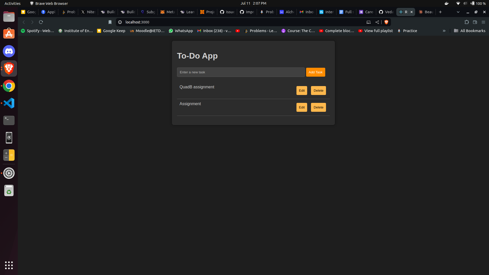
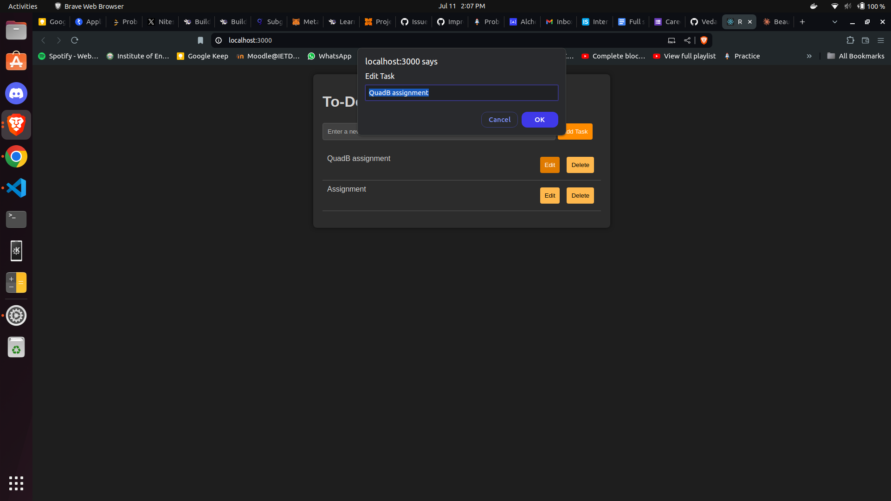

# 🚀 To-Do Application

## 📌 Overview

This is a Todo List application made using ReactJS where users can add, update and delete their tasks.

##  Features

-  Add new tasks
-  View all tasks in a clean, organized list
-  Edit existing tasks
-  Delete tasks with ease
-  Responsive and user-friendly dark mode UI

## Technologies Used

-  ReactJS
-  HTML
-  CSS

